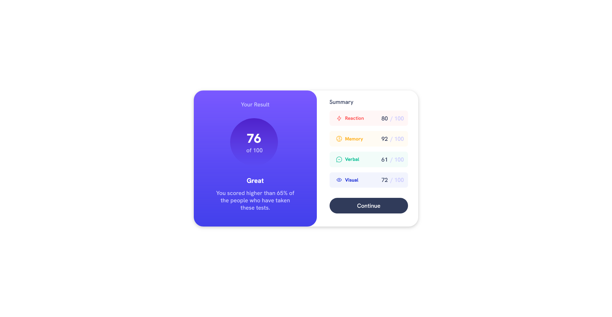

# Frontend Mentor - Results summary component solution

This is a solution to the [Results summary component challenge on Frontend Mentor](https://www.frontendmentor.io/challenges/results-summary-component-CE_K6s0maV). Frontend Mentor challenges help you improve your coding skills by building realistic projects. 

## Table of contents

- [Overview](#overview)
  - [The challenge](#the-challenge)
  - [Screenshot](#screenshot)
  - [Links](#links)
- [My process](#my-process)
  - [Built with](#built-with)
  - [What I learned](#what-i-learned)
  - [Continued development](#continued-development)

## Overview

### The challenge

Users should be able to:

- View the optimal layout for the interface depending on their device's screen size
- See hover and focus states for all interactive elements on the page
- **Bonus**: Use the local JSON data to dynamically populate the content

### Screenshot



### Links

- Solution URL: [https://github.com/devaramnye/results-summary-component-main]
- Live Site URL: [https://devaramnye.github.io/results-summary-component-main/]

## My process

### Built with

- Semantic HTML5 markup
- CSS custom properties
- Flexbox
- Mobile-first workflow

### What I learned

I learned a bit more of the usage of flexbox and the properties (flex-grow, flex-shrink and flex-basis) but I am really uncomfortable about the usage of max-width. I need more practice about relationships with percentage but I am really proud of myself that I could finish up this project. I hope you like it.

```css
@media screen and (min-width: 1024px) {
    main {
        max-width: 44rem;
        flex-direction: row;
        gap: 0.5rem;
        box-shadow: 0 3px 10px rgb(0 0 0 / 0.2);
        border-radius: 30px 30px;
    }
    .circle {
        height: 150px;
        width: 150px;
    }
    .first-section {
        flex: 1 1 60%
    }
    .second-section {
        flex: 1 1 40%;
    }
```

### Continued development

I have to make more progress in using flexbox to build better areas. Maybe a peak into grid would be amazing. I am slowly getting in touch with rem for padding, margin, max-width and front-size.